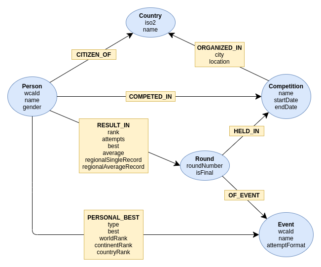

# Dokumentacja projektu

Niniejszy dokument stanowi dokumentację projektu.

Autorzy: [Jonatan Kłosko](https://github.com/jonatanklosko), [Oliwia Masiarek](https://github.com/omasiarek)

## Spis treści

<!-- TBA -->

## 1. Cel

Celem projektu jest zbadanie możliwości grafowej bazy danych (konkretnie [Neo4j](https://neo4j.com/)) w kontekście isteniejącego zbioru danych. Jako że dane te pochodzą z bazy relacyjnej, jednym z elementów jest zaprojektowanie odpowiedniego schematu grafowego, stanowiącego alternatywny sposób ich reprezentacji. Omawiane dane dotyczą zawodów oraz wyników speedcubingowych.

## 2. Kontekst

Speedcubing jest dyscypliną polegającą na układaniu Kostki Rubika oraz innych tego typu łamigłówek w [jak najkrótszym czasie](https://youtu.be/NevGDFBfQGw).

[WCA (World Cube Association)](https://www.worldcubeassociation.org/about) to organizacja odpowiadająca za regulowanie oficjalnych spraw związanych ze speedcubingiem. Zajmuje się między innymi: definiowaniem i ujednolicaniem zasad przeprowadzania zawodów, zapewnianiem poprawnego przebiegu zawodów (przy pomocy reprezentujących ją delegatów), utrzymywaniem oficjalnych rankingów i rekordów oraz prowadzeniu działań mających na celu rozwój speedcubingu.

Zawody WCA odbywają się na całym świecie w każdy weekend, w roku 2019 było ich średnio 25 na tydzień. W tymże roku na zawodach pojawiło się 48 418 różnych osób (średnio 75 zawodników na zawody, 885 na największych z nich), które wykonały łącznie 2 537 840 udanych ułożeń.

Podczas **zawodów** odbywa się od kilku do kilkunasu spośród 17 oficjalnych **konkurencji** (między innymi [kostki](https://www.thecubicle.com/pages/wca-puzzles) w rozmiarach od 2x2x2 do 7x7x7, czworościan/dwunastościan foremny, układanie klasycznej kostki jedną ręką, bez patrzenia oraz w jak najmniejszej liczbie ruchów). Dla danej **konkurencji** może odbywać się od jednej do czterech **rund** (etapów), do których **zawodnicy** awansują na podstawie **rezultatów** uzyskanych z rundzie poprzedniej.

W większości konkurencji podczas rundy zawodnik wykonuje 5 ułożeń (*attempts*), na podstawie których wyróżnia się dwa wskaźniki: najlepsze ułożenie (*best of 5*) oraz średnią obliczaną po odrzuceniu najgorszego i najlepszego wyniku (*average*). Wskaźnikiem determinującym pozycję zawodnika w rundzie jest właśnie średnia.

## 3. Zbiór danych

Analizowane dane pochodzą z [bazy danych WCA](https://www.worldcubeassociation.org/results/misc/export.html),
która jest bazą relacyjną wykorzystującą MySQL.

Na potrzeby projektu wybrano istotny podzbiór tabel i atrybutów, pomijając nieinteresujące dane.
Schemat odpowiedniego fragmentu bazy przedstawia poniższy rysunek (dla porównania ze schematem grafowym omawianym poniżej).


Tabele znajdujące się w bazie WCA:
- `Competitions` - zbiór oficjalnych zawodów WCA
- `Events` - zbiór konkurencji WCA (kilka z nich nie jest już oficjalna, natomiast występują dla nich wyniki)
- `Persons` - zbiór zawodników, którzy kiedykolwiek wzięli udział w zawodach
- `Results` - zbiór wyników z zawodów (każdy rekord odpowiada rezultatom jednej osoby z jednej rundy, czyli zawiera wszystkie 5 ułożeń)
- `Countries` - zbiór krajów rozpoznawanych przez WCA
- `RanksSingle` - zbiór generowany na podstawie `Results`, zawierający najlepsze ułożenie (*best of 5*) w każdej konkurencji dla każdego zawodnika, razem z wyliczoną pozycją na świecie, kontynencie i w kraju
- `RanksAverage` - zbiór generowany na podstawie `Results`, zawierający najlepszą średnią (*average*) w każdej konkurencji dla każdego zawodnika, razem z wyliczoną pozycją na świecie, kontynencie i w kraju
- `RoundTypes` - zbiór zawierający rodzaje rund (np. pierwsza runda, półfinał, finał), rodzaje te mają specyficzne znaczenie dziedzinowe

W przypadku wyników (`Results`), istotnym szczegółem jest sposób przechowywania poszczególnych prób. Pola `value{n}`, `best` oraz `average` w przypadku większości konkurencji są wyrażone jako liczby całkowite reprezentujące liczbę centysekund (zatem czas `1:10.25 s` jest przechowywany jako liczba `7025`). Dodatkowo wyróżnia się trzy szczególne wartości:
- `0` - oznacza pominięcie próby występujące m.i. w przypadku konkurencji, w których wykonywane jest mniej niż 5 ułożeń
- `-1` - reprezentuje wartość DNF (Did Not Finish) oznaczającą dyskwalifikację ułożenia, która może wynikać z zakończenia ułożenia z nieułożoną łamigłówką lub naruszenia regulaminu
- `-2` - reprezentuje wartość DNS (Did Not Start) oznaczającą celowe niewykonanie przez zawodnika próby, pomimo kwalifikowanie się na nią

## 4. Model grafowy

Na podstawie bazy relacyjnej opisanej w powyższym punkcie zaprojektowano schemat grafowy przedstawiony poniżej.



Kolorem niebieskim oznaczono wierzchołki grafu, a żółtym relacje pomiędzy nimi.

### Wierzchołki

#### `Country`

Wierzchołek reprezentujący kraj rozpoznawany przez WCA.

| Atrybut | Typ | Opis |
| --- | --- | --- |
| `iso2` | `string` | Kod [ISO 3166-1 alpha-2](https://en.wikipedia.org/wiki/ISO_3166-1_alpha-2) kraju. |
| `name` | `string` | Nazwa kraju. |

#### `Event`

Wierzchołek reprezentujący oficjalną konkurencję WCA.

| Atrybut | Typ | Opis |
| --- | --- | --- |
| `wcaId` | `string` | Identyfikator konkurencji w czytelnej formie. Przykład: `333` dla klasycznej kostki 3x3x3. |
| `name` | `string` | Nazwa konkurencji. |
| `attemptFormat` | `string` | Rodzaj wyniku w każdej próbie, reprezentowany przez jedną z wartości `"time"` (gdy mierzony jest czas - większość konkurencji), `"number"` (gdy odnotowywana jest liczba - układanie na najmniejszą liczbe ruchów), `"multi"` (w przypadku konkurencji `3x3x3 Wiele Kostek Bez Patrzenia`, odnotowywany jest czas oraz liczba ułożonych kostek). |

#### `Competition`

Wierzchołek reprezentujący zawody WCA.

| Atrybut | Typ | Opis |
| --- | --- | --- |
| `name` | `string` | Nazwa zawodów, zwyczajowo zakończona rokiem w ktorym się odbywają. Przykład: `World Rubik's Cube Championship 2019`. |
| `startDate` | `date` | Data rozpoczęcia zawodów. |
| `endDate` | `date` | Data zakończenia zawodów. |

#### `Person`

Wierzchołek reprezentujący zawodnika. Każdy zawodnik w bazie brał udział w co najmniej jednych zawodach.

| Atrybut | Typ | Opis |
| --- | --- | --- |
| `wcaId` | `string` | Identyfikator przypisywany zawodnikowi po pierwszych zawodach. Składa się on z 4 cyfr reprezentujących rok pierwszego uczestnictwa, 4 pierwszych znaków nazwiska oraz liczby od `01` do `99` używanej do rozróżnienia identyfikatorów mających te same 8 pierwszych znaków. Przykład: `2013KOSK01`. |
| `name` | `string` | Pełne imię i nazwisko zawodnika, może zawierać imię w natywnym języku w nawiasie. Przykład: `Sherlock Holmes (夏洛克·福尔摩斯)`. |
| `gender` | `string` | Płeć reprezentowana przez jedną z wartości `"m"`, `"f"`, `"o"`. |

#### `Round`

Wierzchołek reprezentujący konkretną rundę pewnej konkurencji, która odbyła się na zawodach.

| Atrybut | Typ | Opis |
| --- | --- | --- |
| `roundNumber` | `int` | Numer rundy w danej konkurencji w danych zawodach. W praktyce liczba od `1` do `4`. |
| `isFinal` | `boolean` | Flaga informująca, czy dana liczba jest finałowa (ostatnia w dnaej konkurencji). |

### Relacje

#### `CITIZEN_OF` (`Person` -> `Country`)

Relacja wskazująca na kraj obwatelstwa danej osoby.

#### `ORGANIZED_IN` (`Competition` -> `Country`)

Relacja wskazująca na kraj, w którym mają miejsce dane zawody.

| Atrybut | Typ | Opis |
| --- | --- | --- |
| `cityName` | `string` | Nazwa miasta w którym odbywaja się zawody. |
| `location` | `position` | Lokalizacja miejsca zawodów (szerokość oraz długość geograficzna). |

#### `COMPETED_IN` (`Person` -> `Competition`)

Relacja wskazująca na zawody, w których dana osoba brała udział.

#### `RESULT_IN` (`Person` -> `Round`)

Relacja odpowiadająca wynikowi jaki dana osoba uzyskała w danej rundzie.

| Atrybut | Typ | Opis |
| --- | --- | --- |
| `rank` | `int` | Miejsce uzyskane w danej. |
| `attempts` | `int[]` | Pięcioelementowa lista prób uzyskanych w danej rundzie. Każda próba przechowywana jest jako liczba całkowita, której format został omówiony wyżej. |
| `best` | `int` | Najlepsze ułożenie (*best of 5*). |
| `average` | `int` | Średnia obliczana po odrzuceniu najgorszego i najlepszego wyniku (*average*). W przypadku konkurencji dla których nie jest obliczana `0`. |
| `regionalSingleRecord` | `string`\|`null` | Jeżeli najlepsze ułożenie (`best`) stanowi rekord, atrybut zawiera odpowiedni kod (m.i. `"WR"`, "ER", "NR" odpowiednio dla rekordu świata, europy i kraju). |
| `regionalAverageRecord` | `string`\|`null` | Jeżeli średnia (`average`) stanowi rekord, atrybut zawiera odpowiedni kod (m.i. `"WR"`, "ER", "NR" odpowiednio dla rekordu świata, europy i kraju). |

#### `HELD_IN` (`Round` -> `Competition`)

Relacja wskazująca na zawody, na których odbyła się dana runda.

#### `OF_EVENT` (`Round` -> `Event`)

Relacja wskazująca na konkurencje, której dotyczy dana runda.

#### `PERSONAL_BEST` (`Person` -> `Event`)

Relacja odpowiadająca najlepszemu wynikowi danej osoby w danej konkurencji.

| Atrybut | Typ | Opis |
| --- | --- | --- |
| `type` | `string` | Wartość `"single"` jeżeli relacja dotyczy pojedynczego ułożenia lub `"average"` jeżeli dotyczy średniej. |
| `best` | `int` | Najlepszy wynik (w zależności od `type` dotyczy *best of 5* albo *average*). |
| `worldRank` | `int` | Pozycja na świecie związana z danym wynikiem. |
| `continentRank` | `int` | Pozycja na kontynencie związana z danym wynikiem. |
| `countryRank` | `int` | Pozycja w kraju związana z danym wynikiem. |

## 5. Porównanie schematu relacyjnego z grafowym

Część tabeli w naturalny sposób przekłada się na wierzchołki grafu, a odniesienia
przy pomocy kluczy obcych odpowiadają relacjom, jednak występuje tutaj kilka zasadniczych różnic.

Główną róznicą jaką można odnotować pomiędzy powyżej zaprezentowanymi schematami
jest reprezentacja wyników (`Results`, oraz podobnie `RanksSingle` i `RanksAverage`).
W przypadku bazy relacyjnej dane te przechowywane są w osobnych tabelach
i posiadają odpowiednie odniesienia do zawodnika oraz konkurencji, podczas gdy
w zaprojektowanym modelu grafowym dane te są przechowywane w relacjach pomiędzy wierzchołkami.
Oczywiście również dla tych tabeli możnaby stworzyć odpowiadające im wierzchołki,
jednak wykorzystanie do tego celu relacji jest czytelniejsze i bardziej odpowiada podejściu grafowemu.

W przypadku zawodów, informacje dotyczące lokalizacji (`cityName` oraz `location`)
przeniesiono do relacji `ORGANIZED_IN` łączących zawody z krajem, w którym się odbywają.
Różnica ta ma w dużej mierze znaczenie kosmetyczne.

Kolejną istotną różnicą jest dodanie wierzchołka reprezentującego rundę, który to
nie miał w bazie relacyjnej odpowiadającej tabeli (tabela `RoundTypes`, nie przechowuje
informacji o konkretnych rundach, a jedynie o ich typach, takich jak finał).
Dzięki temu zabiegowi, reprezentacja danych lepiej modeluje rzeczywistość.
Nagromadzenie danych (w szczególności kluczy obcych) w tabeli `Results` wynika
prawdopodobnie z chęci zminimalizowania złączeń potrzebnych do uzyskania danych lub filtrowania
na podstawie określonych informacji. W modelu grafowym nie jest to problemem, ponieważ
przechodzenie po krawędziach w grafie do powiązanych wieszchołków odbywa się w czasie stałym.

Porównując powyższe schematy można dojść do wniosku, że grafowy stanowi bardziej
czytelną reprezentację danych, do tego stopnia, że powinien być bardzo czytelny
nawet dla osób nietechnicznych.

## 6. Importowanie danych

### Wstęp

Omówione wcześniej tabele w bazie relacyjnej posiadają łacznie ~3.7 miliona rekordów,
zatem można przewidywać podobny rząd wielkości dla liczby wierzchołków i relacji w grafie
(liczba ta jest na pewno większa, ponieważ w bazie relacyjnej relacje są przechowywane jako klucze obce,
a nie jako osobne obiekty). W związku z rozmiarem danych istotnym wyzwaniem
jest efektywne zbudowanie zamodelowanego grafu, czyli importowanie danych
przechowywanych relacyjnie do bazy grafowej.

Pierwszym zastosowanym pojdeściem było generowanie plików TSV na podstawie bazy relacyjnej,
a następnie ich importowanie przy pomocy zapytań języka Cypher (przy użyciu `LOAD CSV`),
jednak podejście to skutkowało bardzo długim czasem ładowania danych do bazy grafowej
(czasy rzędu 30 minut) i błędami związanymi z przekroczeniem limitu użycia pamięci RAM.

Baza Neo4j posiada dodatkowe narzędzie służące do importowania danych (`neo4j-admin import`),
zorientowane na masowe ładowanie dużych ilości danych na podstawie specjalnie przystosowanych
plików CSV/TSV. Importując dane przy jego pomocy udało się uzyskać czasy rzędu 30 sekund.

### Generowanie plików TSV na podstawie bazy relacyjnej

Pierwszym etapem było uzyskanie plików TSV/CSV zgodnych z formatem wymaganym przez `neo4j-admin import`.
Narzędzie to opiera się na założeniu, że każdy zbiór wierzchołków oraz relacji danego typu
znajduje się w odpowiadającym mu pliku. Ponadto każdy wierzchołek musi posiadać unikatowy identyfikator
(możliwe ograniczenie wymagania unikalności do obiektów danego typu), a każda relacja musi
posiadać identyfikatory wierzchołka początkowego i końcowego. W wierszu nagłówkowym można
określić typy każdego z atrybutów.

W celu wygenerowania takich plików, pobrano eksport [bazy danych WCA](https://www.worldcubeassociation.org/results/misc/export.html), który to importowano do lokalnej bazy MySQL'owej (wersja 8.0).
Dla każdego typu wierzchołka oraz relacji przygotowano zapytanie w SQL'u,
którego rezultatem była relacja zgodna z opisanym powyżej formatem
(wszystie zapytania znajdują się w folderze `data/sql`). Następnie przy pomocy skryptu
(`data/build_import_data.sh`) wykonano każde z zapytań na lokalnej bazie WCA,
a rezultaty zapisano do plików TSV. W celu uniknięcia potrzeby powtarzania tego procesu
pliki te w postaci zarchiwizowanej wrzucono na Google Drive.

#### Przykład pliku z wierzchołkami - `Competition`

Zapytanie SQL:

```sql
SELECT
  id AS 'wcaId:ID(Competition-ID)',
  name AS 'name',
  start_date AS 'startDate:date',
  end_date AS 'endDate:date',
  'Competition' AS ':LABEL'
FROM Competitions competition
```

Wynikowy plik TSV (pierwsze 5 linii):

```tsv
wcaId:ID(Competition-ID)	name	startDate:date	endDate:date	:LABEL
100Merito2018	100º Mérito 2018	2018-04-14	2018-04-14	Competition
10doRioGrandedoNorte2018	10º do Rio Grande do Norte 2018	2018-12-15	2018-12-16	Competition
12SidesofSilesia2018	12 Sides of Silesia 2018	2018-03-03	2018-03-03	Competition
150thCubeMeetinginBrest2017	150th Cube Meeting in Brest 2017	2017-07-22	2017-07-23	Competition
```

#### Przykład pliku z relacjami - `ORGANIZED_IN`

Zapytanie SQL:

```sql
SELECT
  competition.id AS ':START_ID(Competition-ID)',
  country.iso2 AS ':END_ID(Country-ID)',
  competition.cityName AS 'city',
  CONCAT('{', 'latitude:', latitude / 1000000, ', longitude:', longitude / 1000000 , '}') AS 'location:point',
  'ORGANIZED_IN' AS ':TYPE'
FROM Competitions competition
JOIN Countries country ON country.id = competition.countryId
```

Wynikowy plik TSV (pierwsze 5 linii):

```tsv
:START_ID(Competition-ID)	:END_ID(Country-ID)	city	location:point	:TYPE
100Merito2018	BR	Santarém, Pará	{latitude:-2.4225, longitude:-54.7126}	ORGANIZED_IN
10doRioGrandedoNorte2018	BR	João Câmara, Rio Grande do Norte	{latitude:-5.5364, longitude:-35.8162}	ORGANIZED_IN
12SidesofSilesia2018	PL	Dąbrowa Górnicza	{latitude:50.3245, longitude:19.1795}	ORGANIZED_IN
150thCubeMeetinginBrest2017	BY	Brest	{latitude:52.0823, longitude:23.7416}	ORGANIZED_IN
```

### Importowanie plików TSV do bazy grafowej Neo4j

Tak wygenerowane piki TSV można zaimportować do grafowej bazy danych Neo4j
przy użyciu polecenia `neo4j-admin import`, z podaniem plików z wierzchołkami
oraz relacjami i opcjonalnych opcji konfiguracyjnych. Ważnym wymaganiem jest
aby docelowa baza nie posiadała żadnych danych w momencie importowania.

Pełne wywołanie polecenia można znaleźć w skrypcie `data/import.sh`.
W celu maksymalnego zautomatyzowania procesu tworzenia bazy danych utworzono skrypt `bin/setup_db.sh`
pobierający bazę Neo4j do lokalnego folderu, a następnie importujący dane do tejże
lokalnej bazy.


## 7. Aplikacja

### Główna strona
Na głównej stronie można wybrać konkretnego zawodnika bądź zawody z bazy. Dodatkowo można przejść do konkretnych zakładek:
- porównanie zawodników
- page rank
- rekordy


### Strona zawodów
Na stronie zawodów można zobaczyć wyniki poszczególnych konkurencji i rund


### Strona zawodnika
Na stronie zawodnika można zobaczyć jego rekordy, wykresy dotyczące jego udziału w zawodach oraz poszczególnych konkurencjach. Dodatkowo mamy listę zawodów, w których uczestniczył.


### Porównanie zawodników
W zakładce COMPARE można porównać dwóch zawodników:
- najkrótsza ścieżka ich łącząca
- porównanie rekordów życiowych
- porównanie osiąganych czasów w danych konkurencjach na przestrzeni czasu w formie wykresów
- wspólne zawody


### Page rank
W zakładce page rank


### Rekordy
W zakładce rekordy pokazane są rekordy świata w danych konkurencjach.


